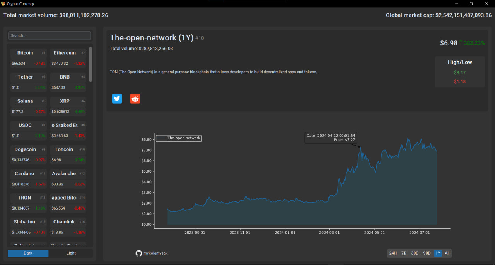
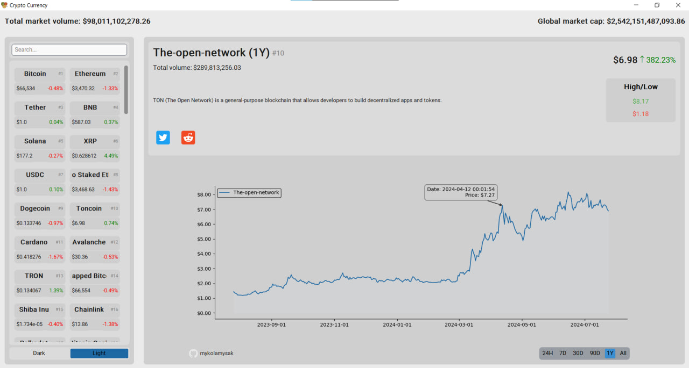

# Crypto Currency 💰

Crypto Currency is a GUI application written in Python that allows users to track and analyze cryptocurrency prices in real-time.

## Navigation 🔍
- [Crypto Currency](#crypto-currency-)
- [Demonstration](#demonstration-)
  - [DarkTheme](#DarkTheme-)
  - [LightTheme](#LightTheme-)
- [Features](#features-)
- [Installation](#installation-)
- [Dependencies](#dependencies-)
- [Project Structure](#project-structure-)
- [Documentation](#documentation-)
- [License](#license-)
- [Author](#author-)
  - [Other Projects](#other-projects-)
- [Contributing](#contributing-)
- [Contact](#contact-)

## Demonstration 📺
### DarkTheme 🌑
  

### LightTheme ☀️
  

## Features 📎

- Display current cryptocurrency prices
- Price charts for various time periods (24 hours, 7 days, 30 days, 90 days, 1 year, all time)
- Market capitalization and trading volume information
- Cryptocurrency search functionality
- Dark and light interface modes
- Links to cryptocurrency social media
- Brief description of each cryptocurrency
- Detailed graph

## Installation 🔨

1. Clone the repository:  
`git clone https://github.com/mykolamysak/CryptoCurrency.git`
2. Navigate to the project directory:  
`cd CryptoCurrency`
3. Install the required dependencies:  
`pip install -r requirements.txt`
4. Start the program  
`python main.py`

## Dependencies 💿

- requests = 2.32.3
- aiohttp = 3.9.5
- customtkinter = 5.2.2
- mplcursors = 0.5.3
- matplotlib = 3.9.1
- pillow = 10.4.0

## Project Structure 📂

- `main.py`: Main application file
- `src/img/`: Directory with images for the interface
- `unittests/`: Directory with Unit Tests
- `requirements.txt`: File listing project dependencies

## Documentation 📄

[CoinGecko](https://www.coingecko.com/en/api) API Documentation  
[CustomTkinter](https://customtkinter.tomschimansky.com/) Documentation

## License 🔐

This project is distributed under the MIT License. See the `LICENSE` file for more details.

## Author 👷

© Mykola Mysak

### Other projects 🐾

Watch my other projects on my [GitHub](https://github.com/mykolamysak?tab=repositories).

## Contributing ➿

Contributions are welcome!  
Please feel free to submit a Pull Request.

## Contact 📞

If you have any questions or suggestions, please contact me via GitHub.